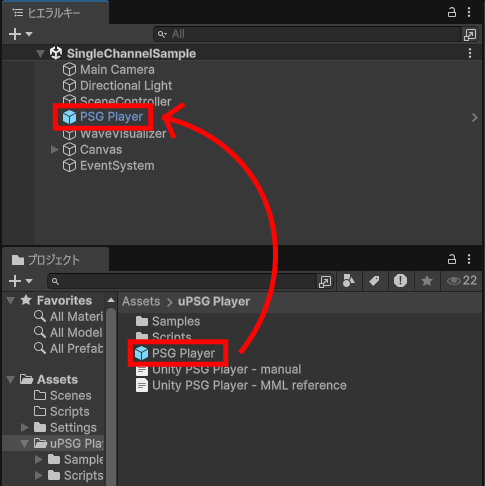
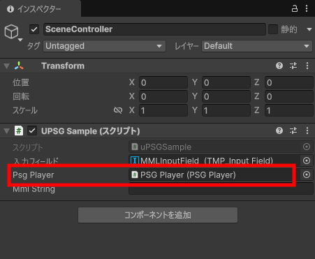
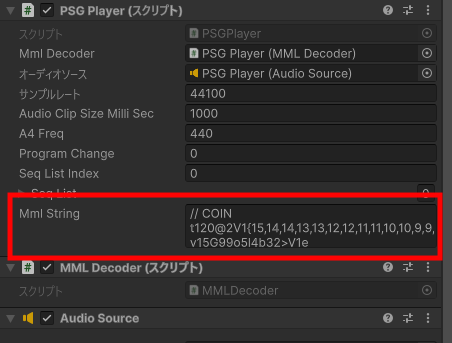
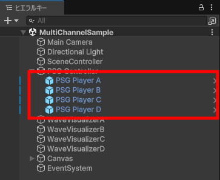
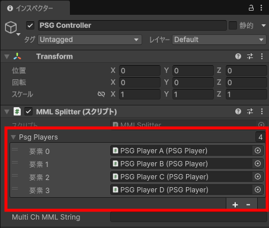
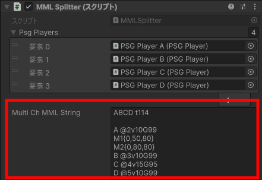

# Unity PSG Player

[日本語](README_JP.md)

This library synthesizes PSG (Programmable Sound Generator) sound sources—commonly known as 8-bit sound—for retro game consoles like the NES within Unity.  
Performance data is specified using MML (Music Macro Language) text, allowing you to easily synthesis sound  in using only scripts by describing the music score with text.  
It is designed to achieve sound characteristics similar to the NES sound source (excluding DPCM).
Since the library does not contain any waveform files, you can reduce the size of the build.  
Also minimized CPU load as much as possible so that you can stream PSG while playing the game.  
Since it is a Unity C# script built entirely using standard classes, it is easy to customize.  
> The documents included in this library have been translated into English using [DeepL](https://www.deepl.com/). Although I have reviewed the content, there may be some incorrect translations. If you find anything that seems off, please let me know.  

## Why I made this

In Unity, whenever I wanted to play a sound effect when a button was pressed, I found it a hassle to create or search for a sound file that was just 0.1 seconds long.  
So, I thought it would be great if I could create sound effects and background music using only scripts, and that's why I started working on it.

## What This Library Can Do

* Four types of square waves, a triangle wave, and two types of noise can be synthesized. The triangle wave is a 4-bit waveform.
* Performance expressions include sweep, LFO (vibrato), and volume envelope.

>I'm not aiming for a perfect recreation of the NES sound source. (It's too much trouble.)  I'm developing this solely to play sounds within Unity, without creating or searching for sound clips.  

For details, refer to the [Manual](./Unity%20PSG%20Player%20-%20manual_EN.md), [Script reference](./Unity%20PSG%20Player%20-%20Script%20refernce_EN.md) and [MML reference](./Unity%20PSG%20Player%20-%20MML%20reference_EN.md).

## Intended Use

* For retro-style game BGM and sound effects.
* When it's a hassle to create or search for sound effects one by one.
* For middle-aged guys like me who want to feel a little nostalgic...

## System Requirements

* Unity 2022.3 (LTS) or later

> I suspect it will work on versions prior to the above, but this has not been confirmed.

## Supported Platforms

* Operation verified
  * Windows
  * Android
* Not supported (currently)
  * Web GL (Rendering is supported)
* Unverified
  * Other than the above

> WebGL is currently unsupported because the browser does not support dynamic streaming.  
> For other platforms, since I don't have the means to verify them myself, I'd appreciate it if you could report them to me.

## Quick Guide

* Download the unitypackage from the [Releases](https://github.com/bokanushi-design/Unity-PSG-Player/releases) page and import it into your project.

### Basic Usage

1. Place the PSG Player prefab in the hierarchy.  

2. Prepare a PSGPlayer Class Instance in the script you are operating, and attach the PSG Player object you have placed.  

3. The MML written in the [mmlString](./Unity%20PSG%20Player%20-%20Script%20refernce_EN.md#mmlstring) variable of the PSGPlayer is played by [Play()](./Unity%20PSG%20Player%20-%20Script%20refernce_EN.md#play).  
For details on MML, refer to the [MML Reference](./Unity%20PSG%20Player%20-%20MML%20reference_EN.md).  

### Multi-channel Usage

1. Place the PSG Player prefab according to the required number of channels.  

2. Attach the MultiChannelController script to an appropriate game object.  
3. Assign the placed PSG Player to the [psgPlayers](./Unity%20PSG%20Player%20-%20Script%20refernce_EN.md#psgplayers) field in the MultiChannelController from the Inspector.  

4. Place the MML into the [multiChMMLString](./Unity%20PSG%20Player%20-%20Script%20refernce_EN.md#multichmmlstring) variable of MultiChannelController, then use [SplitMML()](./Unity%20PSG%20Player%20-%20Script%20refernce_EN.md#splitmml) to distribute the MML to each channel, and then play it using [PlayAllChannels()](./Unity%20PSG%20Player%20-%20Script%20refernce_EN.md#playallchannels).  

## Planned update (maybe)

* Synchronizing channels during multi-channel playback

> ~~Currently, there is no mechanism to synchronize the channels, so repeating the loop may cause them to become out of sync.~~  
> Supported in v0.9.8beta.

* Improving rendering performance

> Performance might improve if avoid using collection classes when generating waveform data.

* Supports WebGL

> There seems to be a way to play it on the web, but whether we'll integrate it is still undecided.
> Only rendering is supported in v0.9.6beta.

* DPCM support

> Once the library can play sampled sounds, it will be able to reproduce the NES sound more accurately.  

* Supports Wavetable Synthesize

> Actually, since the generation of triangular waves uses the same logic as a wavetable synthesizer, we expect to be able to implement it quickly once the specifications are finalized.  
> This makes it possible to reproduce the sounds of the Famicom Disk System, the PC Engine, and other systems.

## Change log

* `v0.9.8 beta`
  * The class name no longer matched its functionality, so MMLSplitter has been renamed to MultiChannelController.
  * Added ChannelSyncMaaker
* `v0.9.7 beta`
  * Added NoteSyncMute
* `v0.9.6 beta`
  * Supports asynchronous rendering
* `v0.9.5 beta`
  * Supports frequency-specific tones
* `v0.9.4 beta`
  * Added rendering functionality
  * Nested Repeats Supported
* `v0.9.3 beta`
  * Supports exporting and importing sequence data in JSON format
* `v0.9.2 beta`
  * Modify the high-frequency behavior of the triangle wave
* `v0.9.1 beta`
  * Change the access modifier of the tickPerNote variable in PSG Player class to public
* `v0.9 beta`
  * A version I expect to work for now.  

## References

NESSOUND.TXT <https://www.nesdev.org/NESSOUND.txt>

## License

* This library is under the MIT License.
