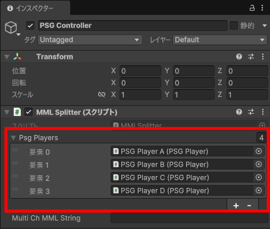

# Unity PSG Player

[日本語](README_JP.md)

This library synthesizes PSG (Programmable Sound Generator) sound sources—commonly known as 8-bit sound—for retro game consoles like the NES within Unity.  
Performance data is specified using MML (Music Macro Language) text, allowing you to easily create music data by describing the score with text.  
It is designed to achieve sound characteristics similar to the NES sound source (excluding DPCM).

## What This Library Can Do

* Four types of square waves, a triangle wave, and two types of noise can be synthesized. The triangle wave is a 4-bit waveform.
* Performance expressions include sweep, LFO (vibrato), and volume envelope.

>I'm not aiming for a perfect recreation of the NES sound source. (It's too much trouble.)  I'm developing this solely to play sounds within Unity, without creating or searching for sound clips.  

For details, refer to the [Manual](Unity%20PSG%20Player%20-%20manual_EN.md) and [MML Reference](Unity%20PSG%20Player%20-%20MML%20reference_EN.md).

## Intended Use

* For retro-style game BGM and sound effects.
* When it's a hassle to create or search for sound effects one by one.

## System Requirements

* Unity 2022.3 (LTS) or later

> I suspect it will work on versions prior to the above, but this has not been confirmed.

## Supported Platforms

* Operation verified
  * Windows
  * Android
* Not supported (currently)
  * Web GL
* Unverified
  * Other than the above

> WebGL is currently unsupported because the browser does not support dynamic streaming.
> For other platforms, since I don't have the means to verify them myself, I'd appreciate it if you could report them to me.

## Quick Guide

* Download the unitypackage from the [Releases](https://github.com/bokanushi-design/Unity-PSG-Player/releases) page and import it into your project.

### Basic Usage

1. Place the PSG Player prefab in the hierarchy.  

2. Prepare a PSGPlayer class variable in the script you are operating, and attach the PSG Player object you have placed.  

3. The MML written in the [mmlString](Unity%20PSG%20Player%20-%20manual_EN.md) variable of the PSGPlayer is played by [Play()](Unity%20PSG%20Player%20-%20manual_EN.md).  
For details on MML, refer to the [MML Reference](Unity%20PSG%20Player%20-%20MML%20reference_EN.md).  

### Multi-channel Usage

1. Place the PSG Player prefab according to the required number of channels.  

2. Attach the MMLSplitter script to an appropriate game object.  
3. Assign the placed PSG Player to the [psgPlayers](Unity%20PSG%20Player%20-%20manual_EN.md) field in the MMLSplitter from the Inspector.  

4. Place the MML into the [multiChMMLString](Unity%20PSG%20Player%20-%20manual_EN.md) variable of MMLSplitter, then use [SplitMML()](Unity%20PSG%20Player%20-%20manual_EN.md) to distribute the MML to each channel, and then play it using [PlayAllChannels()](Unity%20PSG%20Player%20-%20manual_EN.md).  

## Planned update (maybe)

* ~~JSON serialization of sequence data~~

> ~~This may reduce CPU load by decreasing the burden of decoding MML.~~  
> Supported in v0.9.3beta.

* Non-streaming playback

> Pre-rendering and preparing waveform data in advance should improve responsiveness for sound effects and similar elements.

* Supports WebGL

> There seems to be a way to play it on the web, but whether we'll integrate it is still undecided.

* Replace sample music and sound effects with original content

> I'm good at playing by ear, but I'm not so good at composing...  
> If anyone is willing to create a sample track, your assistance would be greatly appreciated.

## License

* This library is under the MIT License.
