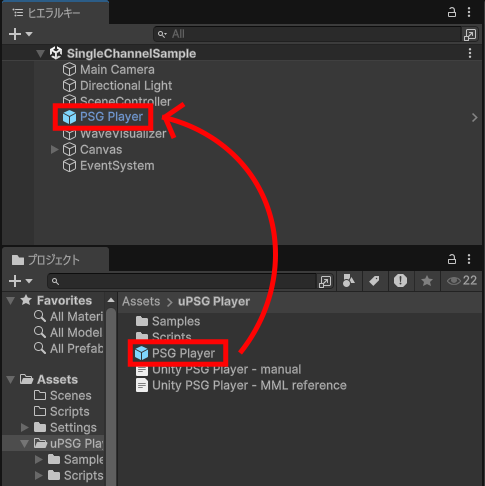
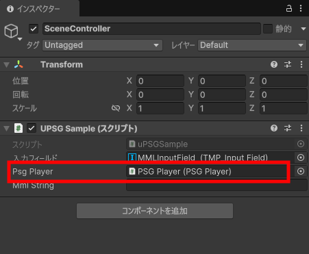
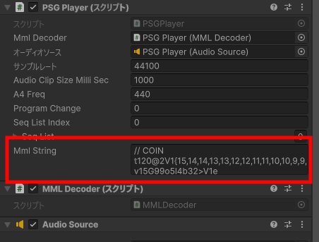
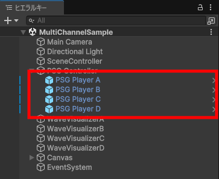
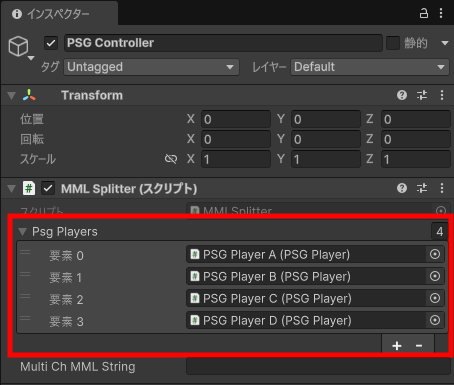
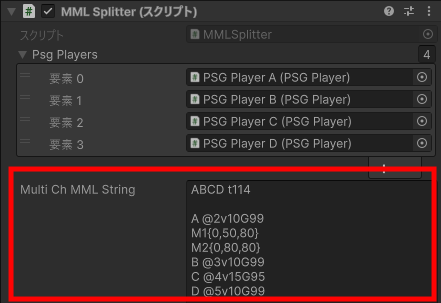

# Unity PSG Player

[English](README.md)

Unity上でレトロゲーム機などのPSG（Programmable Sound Generator）音源（いわゆる8ビットサウンド・ピコピコサウンド）を鳴らすライブラリです。  
演奏データはMML（Music Macro Language）のテキストで、楽譜を文字で記述するため、手軽に音楽データを作成できます。  
ファミコンの音源に似た（DPCMを除く）表現ができるように設計しています。  

## できること

* 音色は、矩形波4種類、三角波、ノイズ2種類が鳴らせます。三角波は4bit波形です。
* 演奏表現として、スイープ、LFO（ビブラート）、音量エンベロープが使えます。

> ファミコン音源の完全再現は目標にしていません。（めんどくさいので。）  
> あくまでも、別途サウンドクリップなどを用意しないで、Unityだけで音を鳴らす目的で制作しています。  

詳細は[マニュアル](Unity%20PSG%20Player%20-%20manual_JP.md)・[MMLリファレンス](Unity%20PSG%20Player%20-%20MML%20reference_JP.md)を参照してください。

## 使用用途

* レトロ調ゲームのBGMや効果音に。
* ちょっとした効果音を一々作ったり探したりするのが面倒なとき。

## 動作環境

* Unity 2022.3(LTS)以上

> 上記以前のバージョンでも動作する気はしますが未確認。

## 対応プラットホーム

* 動作確認済み
  * Windows
  * Android
* 非対応（現状）
  * Web GL
* 未検証
  * 上記以外

> Web GLは、ブラウザーが動的ストリーミングをサポートしていないので、現状は非対応。  
> その他プラットホームは、単に自分では確認できる環境がないので、報告してもらえると助かります。

## クイックガイド

* [Releases](https://github.com/bokanushi-design/Unity-PSG-Player/releases)ページからunitypackageをダウンロードして、プロジェクトにインポートします。

### 基本的な使い方

1. PSG Playerプレハブをヒエラルキーに置きます。  

2. 操作するスクリプトでPSGPlayerクラス変数を用意し、設置したPSG Playerオブジェクトをアタッチします。  

3. PSGPlayerの[mmlString](Unity%20PSG%20Player%20-%20manual_JP.md)変数に記述したMMLが、[Play()](Unity%20PSG%20Player%20-%20manual_JP.md)で再生されます。  
MMLについては「[MMLリファレンス](Unity%20PSG%20Player%20-%20MML%20reference_JP.md)」を参照してください。  

### マルチチャンネルの使い方

1. 必要なチャンネル数に合わせてPSG Playerプレハブを置きます。  

2. 適当なゲームオブジェクトにMMLSplitterスクリプトをアタッチします。  
3. インスペクターからMMLSplitterの[psgPlayers](Unity%20PSG%20Player%20-%20manual_JP.md)に、設置したPSG Playerを割り当てます。  

4. MMLSplitterの[multiChMMLString](Unity%20PSG%20Player%20-%20manual_JP.md)変数にMMLを入れて、[SplitMML()](Unity%20PSG%20Player%20-%20manual_JP.md)で各チャンネルにMMLを分配し、[PlayAllChannels()](Unity%20PSG%20Player%20-%20manual_JP.md)で再生されます。  

## アップデート（するかも）予定

* ~~シーケンスデータのJSON化~~

> ~~MMLをデコードするコストが減るので、CPU負荷の軽減ができるかも？~~  
> v0.9.3betaで対応済み。

* ~~非ストリーム再生~~

> ~~効果音などは、プリレンダリングして波形データを用意しておくことで、レスポンスが良くなりそう。~~  
> v0.9.4bbetaで対応済み。

* Web GLに対応

> Webでも鳴らせる方法があるみたいだけど、統合するかは未定。

* サンプル曲と効果音をオリジナルに変更

> 耳コピは得意なんですが作曲は苦手で。。。  
> どなたか作ってくれる方がいらっしゃいましたらご協力お願いしますm(\_ \_)m  

## 更新履歴

* `v0.9.5 beta`
  * 周波数指定の発音に対応
* `v0.9.4 beta`
  * レンダリング機能を追加
  * リピートのネストに対応
* `v0.9.3 beta`
  * シーケンスデータのJSON形式でのエクスポートとインポートに対応
* `v0.9.2 beta`
  * 三角波の高音域の挙動を変更
* `v0.9.1 beta`
  * PSG Player.csのtickPerNoteをpublicに変更
* `v0.9 beta`
  * とりあえず動くと思うバージョン  

## ライセンス

* MITライセンス
* This library is under the MIT License.
