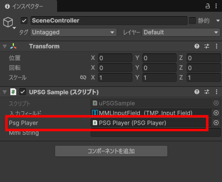
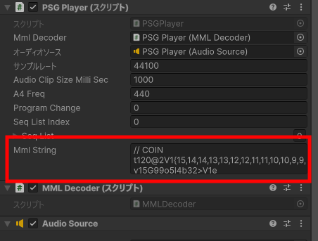
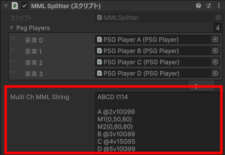

# Unity PSG Player

Unity上でレトロゲーム機などのPSG（Programmable Sound Generator）音源を鳴らすライブラリです。  
演奏データはMML（Music Macro Language）のテキストで、楽譜を文字で記述するため、手軽に音楽データを作成できます。  
ファミコンの音源に似た（DPCMを除く）表現ができるように設計しています。  

* 音色は、矩形波4種類、三角波、ノイズ2種類が鳴らせます。三角波は4bit波形です。
* 演奏表現として、スイープ、LFO（ビブラート）、音量エンベロープが使えます。

> ファミコン音源の完全再現は目標にしていません。（めんどくさいので。）  
> あくまでも、別途サウンドクリップなどを用意しないで、Unityだけで音を鳴らす目的で制作しています。  

PSG Playerはモノフォニック（単音）で発音します。  
ファミコンの4音（DPCMを除く）などを再現するには、PSG Playerを複数設置して同時に再生することで対応します。  


## クイックガイド

### 基本的な使い方

1. PSG Playerプレハブをヒエラルキーに置きます。  


2. 操作するスクリプトでPSGPlayerクラス変数を用意し、設置したPSG Playerオブジェクトをアタッチします。  


3. PSGPlayerの[mmlString](#mmlstring)変数に記述したMMLが、[Play()](#play)で再生されます。  
MMLについては「[MMLリファレンス](Unity%20PSG%20Player%20-%20MML%20reference.md)」を参照してください。  



### マルチチャンネルの使い方

1. 必要なチャンネル数に合わせてPSG Playerプレハブを置きます。  


2. 適当なゲームオブジェクトにMMLSplitterスクリプトをアタッチします。  
3. インスペクターからMMLSplitterの[psgPlayers](#psgplayers)に、設置したPSG Playerを割り当てます。  


4. MMLSplitterの[multiChMMLString](#multichmmlstring)変数にMMLを入れて、[SplitMML()](#splitmml)で各チャンネルにMMLを分配し、[PlayAllChannels()](#playallchannels)で再生されます。  



## 構成

Unity PSG Playerは、

* シーケンスデータに沿って音を生成する「**PSG Player**」
* MMLをシーケンスデータに変換する「**MML Decoder**」
* MMLを分割する「**MML Splitter**」

で構成されています。  
単音で使用する場合はMML Splitterは必要ありません。  
また、PSG Playerで生成した音を鳴らすためにAudioSourceコンポーネントが必要になります。  


## 概要

PSG Playerは矩形波（パルス波）、三角波、ノイズを単音（モノフォニック）で生成します。  
生成した音はAudioClipとしてAudioSourceのリソースにアタッチされ、ストリーム再生します。  
ストリーム再生中のAudioClipは、必要なバッファ分のデータを順次要求し、その都度PSG Playerが波形データを計算します。  

PSG Playerは、List配列のシーケンスデータを順次処理して、音程や音量を計算します。  
MMLからシーケンスデータへの変換はMML Decoderで行います。  

また、マルチチャンネルMMLを振り分けるのにMML Splitterを使います。  
MMLの行ごとに処理し、行頭の文字で振り分けるチャンネルを決定します。  
詳しくは「[MMLリファレンス](Unity%20PSG%20Player%20-%20MML%20reference.md#トラックのヘッダー)」を参照してください。  
MML SplitterはMMLの分配の他に、各PSG Playerのコントロールをまとめて行うことができます。  

効果音をPSGで鳴らす場合、レトロゲーム機などではBGMの1チャンネルの演奏を中断してリアルタイムで効果音を再生していましたが、
PSG Playerでは先読みして演奏した音がバッファリングされる仕様なので、効果音をタイミングよく再生することができません。  
PSG Playerで効果音を再現するには、効果音専用のPSG Playerを別で用意し、BGMの1チャンネルをミュートすることで対応してください。  

なお、マルチチャンネルでPSG Playerを使う場合、AudioMixerを利用すると音量の調整などがしやすくなります。  


## サンプルレートについて

PSG Playerでは生成するAudioClipのサンプルレートを設定できます。  
サンプルレートは1秒間に入るサンプル数です。  
1サンプル毎に処理を行うので、サンプルレートを高くするとCPU負荷も高くなります。  

また、サンプルレートは生成する音の周波数の上限にも影響します。  
音色によって1波長に必要なサンプル数は以下の通りです。  

| 音色 | サンプル数 |
|:----|:----|
| 矩形波 | 2サンプル |
| 25%(75%)パルス波 | 4サンプル |
| 12.5%パルス波	| 8サンプル |
| 三角波 | 32サンプル |

問題なく出せる音の周波数は、サンプルレートを上記のサンプル数で割った値となるので、特に三角波は最高音程が低くなります。  

※あくまでも期待通りの音程が出せる上限であり、高音になると音色は崩れていきます。  
※ノイズは独特な処理をしているので、サンプルレートが低いと高音で音量が下がります。  


## PSG Playerスクリプトリファレンス

### 変数・Public関数一覧

- [変数](#変数)
  - [mmlDecoder](#mmldecoder)
  - [audioSource](#audiosource)
  - [sampleRate](#samplerate)
  - [audioClipSizeMilliSec](#audioclipsizemillisec)
  - [a4Freq](#a4freq)
  - [tickPerNote](#tickpernote)
  - [programChange](#programchange)
  - [seqListIndex](#seqlistindex)
  - [seqList](#seqlist)
  - [mmlString](#mmlstring)
- [Public関数](#public関数)
  - [Play()](#play)
  - [Play(string \_mmlString)](#playstring-_mmlstring)
  - [DecodeMML()](#decodemml)
  - [PlayDecoded()](#playdecoded)
  - [Stop()](#stop)
  - [IsPlaying()](#isplaying)
  - [Mute](#mute)

----
### 変数
----
#### mmlDecoder
``` c#:PSGPlayer.cs
[SerializeField] private MMLDecoder mmlDecoder;
```

MMLをシーケンスデータに変換するMML Decoderコンポーネントを登録します。  

----
#### audioSource
``` c#:PSGPlayer.cs
[SerializeField] private AudioSource audioSource;
```

生成したAudioClipを渡すAudioSourceを登録します。  

----
#### sampleRate
``` c#:PSGPlayer.cs
public int sampleRate = 32000;
```

AudioClipのサンプルレートを設定します。  
デフォルトは32000Hz（32kHz）です。  

----
#### audioClipSizeMilliSec
``` c#:PSGPlayer.cs
public int audioClipSizeMilliSec = 1000;
```

AudioClipの長さを設定します。  
デフォルトは1000msec（1秒）です。  

----
#### a4Freq
``` c#:PSGPlayer.cs
public float a4Freq = 440f;
```

音階の基準となるオクターブ4のラ（o4a）の音の周波数を設定します。  
デフォルトは440Hzです。  
この変数はMMLのコマンドで変更することができます。  

----
#### tickPerNote
``` C#:PSGPlayer.cs
publi int tickPerNote = 960;
```
1拍（4分音符）の分解能を設定します。  
音長はこの分解能に基づいたティック数に変換され、実際の音の長さ（秒）はテンポとこの分解能から計算されます。  

(例：8分音符は480ティックとなり、テンポ120の場合音の長さは  
60[sec] / 120[notePerMin] * 480[tick] / 960[tickPerNote] = 0.25[sec]  
で0.25秒となります。)  

----
#### programChange
``` c#:PSGPlayer.cs
public int programChange;
```

生成する音色の番号です。  

| 番号 | 波形 |
|:--:|:-- |
| 0 | パルス波（12.5%） |
| 1 | パルス波（25%） |
| 2 | 矩形波（50%） |
| 3 | パルス波（75%） |
| 4 | 三角波 |
| 5 | ノイズ |
| 6 | 短周期ノイズ |

この変数はMMLのコマンドで変更することができます。

----
#### seqListIndex
``` c#:PSGPlayer.cs
[SerializeField] private int seqListIndex = 0;
```

シーケンスデータの処理中の位置です。  
主にデバッグ用途で表示します。  

----
#### seqList
``` c#:PSGPlayer.cs
[SerializeField] private List<SeqEvent> seqList = new();
```

シーケンスデータのList配列です。  
主にデバッグ用途で表示します。  

----
#### mmlString
``` c#:PSGPlayer.cs
[Multiline] public string mmlString = "";
```

演奏するMML文字列です。  
この変数をMML Decoderに渡してシーケンスデータに変換します。  

----
### Public関数
----
#### Play()
``` c#:PSGPlayer.cs
public void Play();
```
* パラメーター：なし  

mmlStringのMML文字列をシーケンスデータに変換して、再生を開始します。  

----
#### Play(string _mmlString)
``` c#:PSGPlayer.cs
public void Play(string _mmlString);
```
* パラメーター：_mmlString　MML文字列  

パラメーターの引数をmmlString変数に渡して、シーケンスデータに変換して再生を開始します。  

----
#### DecodeMML()
``` c#:PSGPlayer.cs
public bool DecodeMML();
```
* パラメーター：なし  
* 戻り値：デコード成功でTrue  

mmlStringのMML文字列をMML Decoderに渡してシーケンスデータに変換します。  

----
#### PlayDecoded()
``` c#:PSGPlayer.cs
ublic void PlayDecoded();
```
* パラメーター：なし  

デコード済みのシーケンスデータを再生します。  
変換処理を行わないので、CPU負荷の軽減が期待できます。  

----
#### Stop()
``` c#:PSGPlayer.cs
public void Stop();
```
* パラメーター：なし

再生中の音を停止します。  

----
#### IsPlaying()
``` c#:PSGPlayer.cs
public bool IsPlaying();
```
* パラメーター：なし
* 戻り値：再生中ならTrue

AudioSourceの再生状況を返します。  

----
#### Mute
``` c#:PSGPlayer.cs
public void Mute(bool isOn);
```
* パラメーター：isOn　Trueならミュートオン

ミュートをオンにすると、AudioSourceをミュートにした上で、生成されるサンプルを0（無音）にします。  
Falseで解除すると、AudioSourceは即時にミュート解除されますが、サンプルは次のノートイベントが発生するまで無音を継続します。  
ただし、バッファ済みのサンプルより早くミュート解除した場合は、すでに生成されたサンプルが発音されます。  

----

## MML Splitterスクリプトリファレンス

### 変数・Public関数一覧

- [変数](#変数-1)
  - [psgPlayers](#psgplayers)
  - [multiChMMLString](#multichmmlstring)
- [Public関数](#public関数-1)
  - [SplitMML()](#splitmml)
  - [SplitMML(string \_multiChMMLString)](#splitmmlstring-_multichmmlstring)
  - [SetAllChannelsSampleRate(int \_rate)](#setallchannelssamplerateint-_rate)
  - [SetAllChannelClipSize(int \_msec)](#setallchannelclipsizeint-_msec)
  - [PlayAllChannels()](#playallchannels)
  - [PlayAllChannelsDecoded()](#playallchannelsdecoded)
  - [StopAllChannels()](#stopallchannels)
  - [IsAnyChannelPlaying()](#isanychannelplaying)
  - [MuteChannel(int channel, bool isMute)](#mutechannelint-channel-bool-ismute)

----
### 変数
----
#### psgPlayers
``` c#:MMLSplitter.cs
[SerializeField] private PSGPlayer[] psgPlayers;
```
MMLを分割送信するPSG Playerコンポーネントをチャンネルの数だけ登録します。  

----
#### multiChMMLString
``` c#:MMLSplitter.cs
public string multiChMMLString;
```
分割送信する元のMML文字列を登録します。  

----

### Public関数
----
#### SplitMML()
``` c#:MMLSplitter.cs
public void SplitMML();
```
* パラメーター：なし

multiChMMLStringのMML文字列を分割して、psgPlayersに登録されてるPSG Playerに送信します。  
送信チャンネルの振り分けについては「[MMLリファレンス](Unity%20PSG%20Player%20-%20MML%20reference.md#トラックのヘッダー)」を参照してください。  

----
#### SplitMML(string _multiChMMLString)
``` c#:MMLSplitter.cs
public void SplitMML(string _multiChMMLString);
```
* パラメーター：_multiChMMLString　マルチチャンネルのMML文字列

パラメーターの引数をmultiChMMLString変数に渡して、MMLをPSG Playerに分割送信します。  

----
#### SetAllChannelsSampleRate(int _rate)
``` c#:MMLSplitter.cs
public void SetAllChannelsSampleRate(int _rate);
```
* パラメーター：_rate　サンプルレート

全てのPSG Playerのサンプルレートを設定します（単位Hz）。  

----
#### SetAllChannelClipSize(int _msec)
``` c#:MMLSplitter.cs
public void SetAllChannelClipSize(int _msec);
```
* パラメーター：_msec　AudioClipの長さ

全てのPSG PlayerのAudioClip長さを設定します（単位ミリ秒）。  

----
#### PlayAllChannels()
``` c#:MMLSplitter.cs
public void PlayAllChannels();
```
* パラメーター：なし

全てのPSG Playerで同時にMMLをデコードして再生します。  

----
#### PlayAllChannelsDecoded()
``` c#:MMLSplitter.cs
public void PlayAllChannelsDecoded();
```
* パラメーター：なし

全てのPSG Playerで同時にデコード済みのシーケンスデータを再生します。  

----
#### StopAllChannels()
``` c#:MMLSplitter.cs
public void StopAllChannels();
```
* パラメーター：なし

全てのPSG Playerの再生を停止します。  

----
#### IsAnyChannelPlaying()
``` c#:MMLSplitter.cs
public bool IsAnyChannelPlaying();
```
* パラメーター：なし
* 戻り値：いずれかのPSG Playerが再生中ならTrue

各PSG PlayerのAudioSourceのうち、どれか一つでも再生中ならTrueを返します。  

----
#### MuteChannel(int channel, bool isMute)
``` c#:MMLSplitter.cs
public void MuteChannel(int channel, bool isMute);
```
* パラメーター：channel　対象チャンネル  
　　　　　　　isMute　Trueならミュートオン

指定したチャンネルをミュートします。

