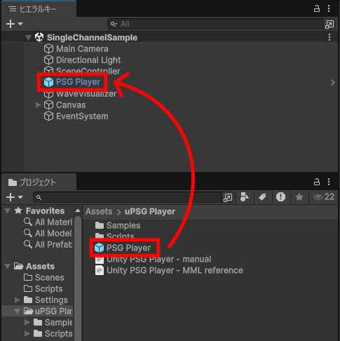
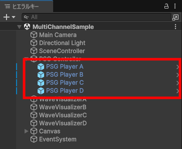
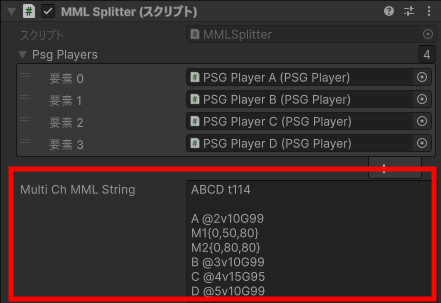

# Unity PSG Player

This is a library for synthesis PSG (Programmable Sound Generator) sound sources such as retro game consoles on Unity. The performance data is MML (Music Macro Language) text, which describes musical notation in text, allowing easy creation of music data. The library is designed to produce expressions similar to those of NES sound generators (except DPCM).

* The sound generator can produce four types of square waves, a triangle wave, and two types of noise. The triangle wave is a 4-bit waveform.
* Performance expressions include sweep, LFO (vibrato), and volume envelope.

> I'm not aiming for a perfect recreation of the Famicom sound source. (It's too much trouble.)  
> My goal is solely to produce sounds using only Unity, without preparing separate sound clips.

The PSG Player produces monophonic (single-note) sound. To play NES 4-note polyphonic sounds (excluding DPCM), you can achieve this by preparing multiple PSG Players and playing them simultaneously.

## Quick Guide

### Basic Usage

1. Place the PSG Player prefab in the Hierarchy.  


2. Prepare a PSGPlayer class variable in the script you are operating, and attach the PSG Player object you have placed.  


3. The MML written in the [mmlString](#mmlstring) variable of the PSGPlayer will be played by [Play()](#play) function.  
For details on MML, refer to the [MML Reference](Unity%20PSG%20Player%20-%20MML%20reference.md).  


### Multi-channel Usage

1. Place the PSG Player prefab according to the required number of channels.  


2. Attach the MMLSplitter script to the appropriate game object.  
3. Assign the placed PSG Player to the [psgPlayers](#psgplayers) of the MMLSplitter from the Inspector.  


4. Place the MML into the [multiChMMLString](#multichmmlstring) variable of MMLSplitter, distribute the MML to each channel using the [SplitMML()](#splitmml) function, and play it using the [PlayAllChannels()](#playallchannels) function.  


## Composition

The Unity PSG Player consists of:

* The “**PSG Player**” that synthesizes sound according to sequence data
* The “**MML Decoder**” that converts MML to sequence data
* The “**MML Splitter**” that splits MML


MML Splitter is not required for single sound use.  
An AudioSource component is also required to play the sound generated by PSG Player.  

## Summary

PSG Player synthesizes monophonic waveforms: square waves (pulse waves), triangle waves, and noise.
The generated sound is attached as an AudioClip to an AudioSource resource and streamed.
During streaming, the AudioClip sequentially requests the necessary buffer data, and PSG Player calculates the waveform data for each request.  

PSG Player sequentially processes sequence data from a List array to calculate pitch and volume.
Conversion from MML to sequence data is performed by the MML Decoder.  

Additionally, use the MML Splitter to distribute multi-channel MML.
It processes each line of the MML and determines the destination channel based on the characters at the beginning of the line.
For details, refer to the [MML Reference](Unity%20PSG%20Player%20-%20MML%20reference.md).
Besides distributing MML, the MML Splitter can also centralize control over each PSG Player.  

When playing sound effects using PSG, retro game consoles would interrupt the playback of one BGM channel to play sound effects in real time. However, the PSG Player buffers pre-loaded sounds, making it impossible to play sound effects with precise timing.  
To play sound effects in PSG Player similarly to retro game consoles, prepare a separate PSG Player instance dedicated solely to sound effects and mute one of the BGM channels.

When using PSG Player in multi-channel mode, using the AudioMixer makes it easier to adjust volume levels and other settings.  

## About Sample rate

PSG Player allows you to set the sample rate for generated AudioClips.
The sample rate is the number of samples per second.
Since processing occurs for each sample, increasing the sample rate also increases CPU load.  

Additionally, the sample rate affects the upper limit of the frequency of the generated sound.  
The number of samples required per wavelength varies depending on the tone, as follows:  

| Tone | Samples |
|:----|:----|
| Square wave | 2 samples |
| 25%(75%) Pulse wave | 4 samples |
| 12.5% Pulse wave | 8 samples |
| Triangle wave | 32 samples |

The frequency of sound that can be produced without issues is determined by dividing the sample rate by the number of samples mentioned above, ~~so the highest pitch achievable, especially for a triangle wave, will be lower~~.

`v0.9.2beta` Slightly modified the triangle wave generation logic, enabling it to produce high frequencies comparable to those of a square wave.

* This represents the upper limit for achieving the expected pitch; higher notes will cause the tone to deteriorate.  
 At the default sampling rate, proper sound reproduction is only guaranteed up to approximately the seventh octave (o7).  
* Due to unique noise processing, lower sample rates will cause volume to decrease at high frequencies.  

## PSG Player script refference

### List of Variables & Public Functions

* [Variables](#variables)
  * [mmlDecoder](#mmldecoder)
  * [audioSource](#audiosource)
  * [sampleRate](#samplerate)
  * [audioClipSizeMilliSec](#audioclipsizemillisec)
  * [a4Freq](#a4freq)
  * [tickPerNote](#tickpernote)
  * [programChange](#programchange)
  * [seqListIndex](#seqlistindex)
  * [seqList](#seqlist)
  * [mmlString](#mmlstring)
* [Public Functions](#public-functions)
  * [Play()](#play)
  * [Play(string \_mmlString)](#playstring-_mmlstring)
  * [DecodeMML()](#decodemml)
  * [PlayDecoded()](#playdecoded)
  * [PlaySequence()](#playsequence)
  * [Stop()](#stop)
  * [IsPlaying()](#isplaying)
  * [Mute(bool isOn)](#mutebool-ison)
  * [ExportSeqJson(bool _prettyPrint)](#exportseqjsonbool-_prettyprint)
  * [DecodeAndExportSeqJson(bool _prettyPrint)](#decodeandexportseqjsonbool-_prettyprint)
  * [GetSeqJson()](#getseqjson)
  * [ImportSeqJson(string _jsonString)](#importseqjsonstring-_jsonstring)
  * [SetSeqJson(SeqJson _seqJson)](#setseqjsonseqjson-_seqjson)

----

### Variables

----

#### mmlDecoder

``` c#:PSGPlayer.cs
[SerializeField] private MMLDecoder mmlDecoder;
```

Register the MML Decoder component that converts MML into sequence data.  

----

#### audioSource

``` c#:PSGPlayer.cs
[SerializeField] private AudioSource audioSource;
```

Register the AudioSource that will receive the generated AudioClip.  

----

#### sampleRate

``` c#:PSGPlayer.cs
public int sampleRate = 32000;
```

Sets the sample rate for the AudioClip.  
The default is 32000Hz (32kHz).  

----

#### audioClipSizeMilliSec

``` c#:PSGPlayer.cs
public int audioClipSizeMilliSec = 1000;
```

Sets the length of the AudioClip.  
The default is 1000 milliseconds (1 second).  

----

#### a4Freq

``` c#:PSGPlayer.cs
public float a4Freq = 440f;
```

Set the frequency of the A note in the fourth octave (o4a), which serves as the standard for the musical scale.  
The default is 440Hz.  
This variable can be changed using MML commands.  

----

#### tickPerNote

``` C#:PSGPlayer.cs
public int tickPerNote = 960;
```

Set the resolution to one beat (quarter note).  
Note duration is converted to the number of ticks based on this resolution, and the actual note length (in seconds) is calculated from the tempo and this resolution.  

(Example: An eighth note corresponds to 480 ticks. At a tempo of 120, the note duration is  
60[sec] / 120[notePerMin] * 480[tick] / 960[tickPerNote] = 0.25[sec]  
which equals 0.25 seconds.)  

----

#### programChange

``` c#:PSGPlayer.cs
public int programChange;
```

The number of the tone to be generated.  

| Number | Wave form |
|:--:|:-- |
| 0 | Pulse wave（12.5%） |
| 1 | Pulse wave（25%） |
| 2 | Square wave（50%） |
| 3 | Pulse wave（75%） |
| 4 | Triangle wave |
| 5 | Noise |
| 6 | Short-cycle noise |

This variable can be changed using MML commands.

----

#### seqListIndex

``` c#:PSGPlayer.cs
[SerializeField] private int seqListIndex = 0;
```

Current position in sequence data processing.  
Mainly displayed for debugging purposes.  

----

#### seqList

``` c#:PSGPlayer.cs
[SerializeField] private List<SeqEvent> seqList = new();
```

A List array of sequence data.  
Mainly displayed for debugging purposes.  

----

#### mmlString

``` c#:PSGPlayer.cs
[Multiline] public string mmlString = "";
```

This is the MML string to be played.  
Pass this variable to the MML Decoder to convert it into sequence data.  

----

### Public Functions

----

#### Play()

``` c#:PSGPlayer.cs
public void Play();
```

* Parameter : None  

Converts the MML string in the mmlString variable into sequence data and begins playback.  

----

#### Play(string _mmlString)

``` c#:PSGPlayer.cs
public void Play(string _mmlString);
```

* Parameter : **_mmlString** MML string  

Pass the parameter arguments to the mmlString variable, convert them to sequence data, and start playback.  

----

#### DecodeMML()

``` c#:PSGPlayer.cs
public bool DecodeMML();
```

* Parameter : None  
* Return value : `True` if decoding succeeds  

Pass the MML string from the mmlString variable to the MML Decoder to convert it into sequence data.  

----

#### PlayDecoded()

``` c#:PSGPlayer.cs
public void PlayDecoded();
```

* Parameter : None  

Plays back decoded sequence data.  
Since no conversion processing is performed, reduced CPU load is expected.  

----

#### PlaySequence()

``` c#:PSGPlayer.cs
public void PlaySequence();
```

* Parameter : None  

Plays back decoded sequence data.  
Same as [PlayDecoded()](#playdecoded).

----

#### Stop()

``` c#:PSGPlayer.cs
public void Stop();
```

* Parameter : None  

Stop the currently playing audio.  

----

#### IsPlaying()

``` c#:PSGPlayer.cs
public bool IsPlaying();
```

* Parameter : None
* Return value : `True` if playing

Returns the playback status of AudioSource.  

----

#### Mute(bool isOn)

``` c#:PSGPlayer.cs
public void Mute(bool isOn);
```

* Parameter: **isOn** Set `True` to Mute on

When muted, the AudioSource is silenced and the generated sample is set to 0 (silence).  
When unmuted with `False`, the AudioSource is immediately unmuted, but the sample remains silent until the next note event occurs.  
However, if unmuted before the buffered sample plays out, the already generated sample will be played.  

----

#### ExportSeqJson(bool _prettyPrint)

``` c#:PSGPlayer.cs
public string ExportSeqJson(bool _prettyPrint)
```

* Parameter: **_prettyPrint** `True` enables line breaks and indentation (`False` by default)
* Return value: **JSON string**

The decoded MML sequence data is converted to JSON and output as a string.  
If there is no sequence data ([DecodeMML()](#decodemml) or [Play()](#play) has not been called), Null is returned.  
The JSON content combines the [tickPerNote](#tickpernote) value with the [seqList](#seqlist).

----

#### DecodeAndExportSeqJson(bool _prettyPrint)

``` c#:PSGPlayer.cs
public string DecodeAndExportSeqJson(bool _prettyPrint)
```

* Parameter: **_prettyPrint** `True` enables line breaks and indentation (`False` by default)
* Return value: **JSON string**

After decoding MML, serializes the sequence data into JSON and outputs it.  

----

#### GetSeqJson()

``` c#:PSGPlayer.cs
public SeqJson GetSeqJson()
```

* Parameter: None
* Return value: **SeqJson class object**

Outputs the decoded MML sequence data as a SeqJson class object.  
This is the data before being converted to JSON by [ExportSeqJson()](#exportseqjsonbool-_prettyprint).  
It is primarily used when exporting multi-channel JSON with the MML Splitter.

----

#### ImportSeqJson(string _jsonString)

``` c#:PSGPlayer.cs
public bool ImportSeqJson(string _jsonString)
```

* Parameter: **_jsonString** JSON string
* Return value: `True` if import succeeds

Import JSON-formatted strings as sequence data.  
At this time, the value of [tickPerNote](#tickpernote) is also loaded.

----

#### SetSeqJson(SeqJson _seqJson)

``` c#:PSGPlayer.cs
public bool SetSeqJson(SeqJson _seqJson)
```

* Parameter: **_jsonString** JSON string
* Return value: `True` if import succeeds

Directly reads the [tickPerNote](#tickpernote) value and sequence data from a SeqJson class object.  
Primarily used when importing multi-channel JSON with MML Splitter.

----

## MML Splitter script refference

### [MML Splitter] List of Variables & Public Functions

* [Variables](#mml-splitter-variables)
  * [psgPlayers](#psgplayers)
  * [multiChMMLString](#multichmmlstring)
* [Public Functions](#mml-splitter-public-functions)
  * [SplitMML()](#splitmml)
  * [SplitMML(string \_multiChMMLString)](#splitmmlstring-_multichmmlstring)
  * [SetAllChannelsSampleRate(int \_rate)](#setallchannelssamplerateint-_rate)
  * [SetAllChannelClipSize(int \_msec)](#setallchannelclipsizeint-_msec)
  * [PlayAllChannels()](#playallchannels)
  * [PlayAllChannelsDecoded()](#playallchannelsdecoded)
  * [PlayAllChannelsSequence()](#playallchannelssequence)
  * [DecodeAllChannels()](#decodeallchannels)
  * [StopAllChannels()](#stopallchannels)
  * [IsAnyChannelPlaying()](#isanychannelplaying)
  * [MuteChannel(int channel, bool isMute)](#mutechannelint-channel-bool-ismute)
  * [ExportMultiSeqJson(bool _prettyPrint)](#exportmultiseqjsonbool-_prettyprint)
  * [DecodeAndExportMultiSeqJson(bool _prettyPrint)](#decodeandexportmultiseqjsonbool-_prettyprint)
  * [ImportMultiSeqJson(string _jsonString)](#importmultiseqjsonstring-_jsonstring)

----

### [MML Splitter] Variables

----

#### psgPlayers

``` c#:MMLSplitter.cs
[SerializeField] private PSGPlayer[] psgPlayers;
```

Register a PSG Player component for each channel to send the MML in segments.  

----

#### multiChMMLString

``` c#:MMLSplitter.cs
public string multiChMMLString;
```

Register the original MML string to be sent in segments.  

----

### [MML Splitter] Public Functions

----

#### SplitMML()

``` c#:MMLSplitter.cs
public void SplitMML();
```

* Parameter : None

Splits the MML string from multiChMMLString and sends it to the PSG Player registered in psgPlayers.  
For channel assignment details, refer to “[MML Reference](Unity%20PSG%20Player%20-%20MML%20reference.md#Track%20Header)”.  

----

#### SplitMML(string _multiChMMLString)

``` c#:MMLSplitter.cs
public void SplitMML(string _multiChMMLString);
```

* Parameter : **_multiChMMLString** Multi-channel MML string

Pass the parameter arguments to the multiChMMLString variable to send the MML to PSG Player in segments.  

----

#### SetAllChannelsSampleRate(int _rate)

``` c#:MMLSplitter.cs
public void SetAllChannelsSampleRate(int _rate);
```

* Parameter : **_rate** Sample rate

Set the sample rate for all PSG players (in Hz).  

----

#### SetAllChannelClipSize(int _msec)

``` c#:MMLSplitter.cs
public void SetAllChannelClipSize(int _msec);
```

* Parameter : **_msec** AudioClip length

Sets the AudioClip length for all PSG Players (in milliseconds).  

----

#### PlayAllChannels()

``` c#:MMLSplitter.cs
public void PlayAllChannels();
```

* Parameter : None

All PSG Players decode MML and play simultaneously.  

----

#### PlayAllChannelsDecoded()

``` c#:MMLSplitter.cs
public void PlayAllChannelsDecoded();
```

* Parameter : None

Play back the decoded sequence data simultaneously on all PSG Players.  

----

#### PlayAllChannelsSequence()

``` c#:MMLSplitter.cs
public void PlayAllChannelsSequence()
```

* Parameter : None

Plays sequence data simultaneously on all PSG players.  
Same as [PlayAllChannelsDecoded()](#playallchannelsdecoded).

----

#### DecodeAllChannels()

``` c#:MMLSplitter.cs
public void DecodeAllChannels()
```

* Parameter : None

All PSG Players decode MML into sequence data.  
Since multi-channel MML is not transmitted in split segments, please execute [SplitMML()](#splitmml) beforehand.

----

#### StopAllChannels()

``` c#:MMLSplitter.cs
public void StopAllChannels();
```

* Parameter : None

Stop playing all PSG players.  

----

#### IsAnyChannelPlaying()

``` c#:MMLSplitter.cs
public bool IsAnyChannelPlaying();
```

* Parameter : None
* Return value : `True` if any PSG Player is currently playing

Returns `True` if any of the AudioSources for each PSG Player is currently playing.  

----

#### MuteChannel(int channel, bool isMute)

``` c#:MMLSplitter.cs
public void MuteChannel(int channel, bool isMute);
```

* Parameter: **channel** Target channel  
　　　　　　　**isMute** `True` for mute on

Mutes the specified channel.

----

#### ExportMultiSeqJson(bool _prettyPrint)

``` c#:MMLSplitter.cs
public string ExportMultiSeqJson(bool _prettyPrint)
```

* Parameter: **_prettyPrint**  Enables line breaks and indentation when set to `True` (default `False`)
* Return value: **JSON string**

The decoded MML sequence data for each PSG Player is consolidated into JSON and output as a string.  
The JSON contents consist of a list of [SeqJson class objects](#getseqjson) output by each PSG Player.

----

#### DecodeAndExportMultiSeqJson(bool _prettyPrint)

``` c#:MMLSplitter.cs
public string DecodeAndExportMultiSeqJson(bool _prettyPrint)
```

* Parameter: **_prettyPrint**  Enables line breaks and indentation when set to `True` (default `False`)
* Return value: **JSON string**

Each PSG Player's MML is decoded, then the sequence data is converted to JSON and output.  
Since multi-channel MML is not transmitted in split segments, please execute [SplitMML()](#splitmml) beforehand.

----

#### ImportMultiSeqJson(string _jsonString)

``` c#:PSGPlayer.cs
public void ImportMultiSeqJson(string _jsonString)
```

* Parametr: **_jsonString** JSON string

Import JSON-formatted strings as multi-channel sequence data.  

----
