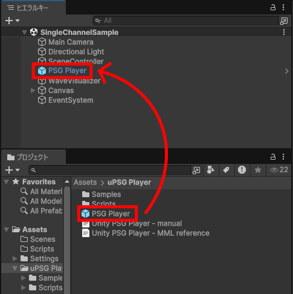
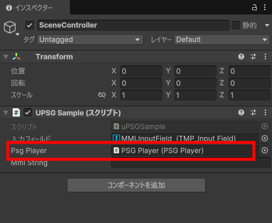
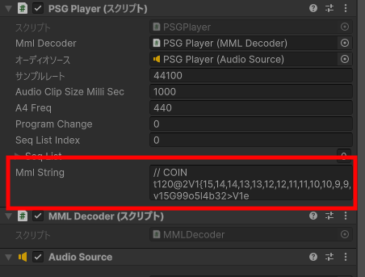
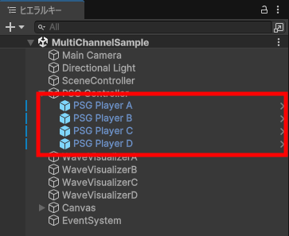
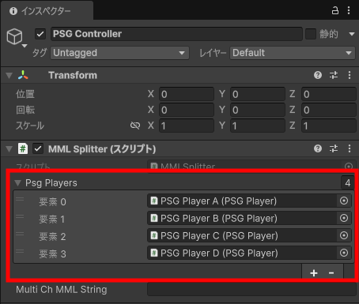
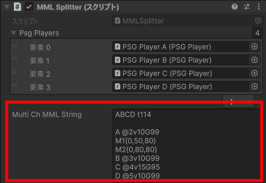

# Unity PSG Player

Unity上でレトロゲーム機などのPSG（Programmable Sound Generator）音源を鳴らすライブラリです。  
演奏データはMML（Music Macro Language）のテキストで、楽譜を文字で記述するため、手軽に音楽データを作成できます。  
ファミコンの音源に似た（DPCMを除く）表現ができるように設計しています。  

* 音色は、矩形波4種類、三角波、ノイズ2種類が鳴らせます。三角波は4bit波形です。
* 演奏表現として、スイープ、LFO（ビブラート）、音量エンベロープが使えます。

> ファミコン音源の完全再現は目標にしていません。（めんどくさいので。）  
> あくまでも、別途サウンドクリップなどを用意しないで、Unityだけで音を鳴らす目的で制作しています。  

PSG Playerはモノフォニック（単音）で発音します。  
ファミコンの4音（DPCMを除く）などを再現するには、PSG Playerを複数設置して同時に再生することで対応します。  

## クイックガイド

### 基本的な使い方

1. PSG Playerプレハブをヒエラルキーに置きます。  

2. 操作するスクリプトでPSGPlayerクラス変数を用意し、設置したPSG Playerオブジェクトをアタッチします。  

3. PSGPlayerの[mmlString](./Unity%20PSG%20Player%20-%20Script%20refernce_JP.md#mmlString)変数に記述したMMLが、[Play()](./Unity%20PSG%20Player%20-%20Script%20refernce_JP.md#play)で再生されます。  
MMLについては「[MMLリファレンス](./Unity%20PSG%20Player%20-%20MML%20reference_JP.md)」を参照してください。  

### マルチチャンネルの使い方

1. 必要なチャンネル数に合わせてPSG Playerプレハブを置きます。  

2. 適当なゲームオブジェクトにMMLSplitterスクリプトをアタッチします。  
3. インスペクターからMMLSplitterの[psgPlayers](./Unity%20PSG%20Player%20-%20Script%20refernce_JP.md#psgplayers)に、設置したPSG Playerを割り当てます。  

4. MMLSplitterの[multiChMMLString](./Unity%20PSG%20Player%20-%20Script%20refernce_JP.md#multichmmlstring)変数にMMLを入れて、[SplitMML()](./Unity%20PSG%20Player%20-%20Script%20refernce_JP.md#splitmml)で各チャンネルにMMLを分配し、[PlayAllChannels()](./Unity%20PSG%20Player%20-%20Script%20refernce_JP.md#playallchannels)で再生されます。  

## MMLについて

**MML（Music Macro Language）** は、音符、音の長さ、オクターブなどをアルファベット（例：cdefgab）と数字で記述し、コンピュータで音楽を自動演奏させるテキストベースのデータ記述言語です。  
Unity PSG Playerで扱えるMMLについては「[MMLリファレンス](./Unity%20PSG%20Player%20-%20MML%20reference_JP.md)」を参照してください。  

## 構成

Unity PSG Playerは、

* シーケンスデータに沿って音を生成する「**PSG Player**」
* MMLをシーケンスデータに変換する「**MML Decoder**」
* MMLを分割する「**MML Splitter**」

で構成されています。  

単音で使用する場合はMML Splitterは必要ありません。  
また、PSG Playerで生成した音を鳴らすためにAudioSourceコンポーネントが必要になります。  

**PSG Player**は、楽譜情報を文字列で記載したMMLを[mmlString変数](./Unity%20PSG%20Player%20-%20Script%20refernce_JP.md#mmlstring)に保持しますが、実際に音を生成するためにはList配列のシーケンスデータ[seqList変数](./Unity%20PSG%20Player%20-%20Script%20refernce_JP.md#seqlist)にする必要があります。  

MMLからシーケンスデータへの変換は、**MML Decoder**で行います。  
MML Decoderは、MMLを1文字ずつ解析し、「コマンド・パラメータ・長さ」の[イベントデータに変換して、[シーケンスデータ](#シーケンスデータについて)にまとめて返します。  
再生時やレンダリング時には、シーケンスデータを順次処理して、音程や音量を計算し、矩形波（パルス波）・三角波・ノイズを単音（モノフォニック）で生成します。  

音の生成方法は、大分して「**ストリーム再生**」と「**レンダリング**」の二通りあります。  
ストリーム再生中のAudioClipは、必要なバッファ分のデータを順次要求し、その都度PSG Playerが波形データを計算します。  
レンダリングは、シーケンス全体をサンプル毎に計算し、波形データを生成します。  
レンダリングしたデータは、通常のAudioClipとして扱うことができます。  

シーケンスデータは、JSON形式でエクスポート・インポートすることができます。  

マルチチャンネルMMLを振り分けるのには、**MML Splitter**を使います。  
MMLの行ごとに処理し、行頭の文字で振り分けるチャンネルを決定します。  
詳しくは「[MMLリファレンス](./Unity%20PSG%20Player%20-%20MML%20reference_JP.md#トラックのヘッダー)」を参照してください。  
MML SplitterはMMLの分配の他に、各PSG Playerのコントロールをまとめて行うことができます。  
また、各PSG Playerで生成した波形データをミックスして一つのAudioClipとして出力することもできます。

効果音をPSGで鳴らす場合、レトロゲーム機などではBGMの1チャンネルの演奏を中断してリアルタイムで効果音を再生していましたが、
PSG Playerでは先読みして演奏した音がバッファリングされる仕様なので、効果音をタイミングよく再生することができません。  
PSG Playerで効果音を再現するには、効果音専用のPSG Playerを別で用意し、BGMの1チャンネルをミュートすることで対応してください。  

なお、マルチチャンネルでPSG Playerを使う場合、AudioMixerを利用すると音量の調整などがしやすくなります。  

## サンプルレートについて

PSG Playerでは生成するAudioClipのサンプルレートを設定できます。  
サンプルレートは1秒間に入るサンプル数です。  
1サンプル毎に処理を行うので、サンプルレートを高くするとCPU負荷も高くなります。  

また、サンプルレートは生成する音の周波数の上限にも影響します。  
音色によって1波長に必要なサンプル数は以下の通りです。  

| 音色 | サンプル数 |
| :---- | :---- |
| 矩形波 | 2サンプル |
| 25%(75%)パルス波 | 4サンプル |
| 12.5%パルス波 | 8サンプル |
| 三角波 | 32サンプル |

問題なく出せる音の周波数は、サンプルレートを上記のサンプル数で割った値となるので、~~特に三角波は最高音程が低くなります。~~  

`v0.9.2beta`三角波の生成ロジックを少し変更したので、矩形波と同程度の高音まで出せるようになりました。

※あくまでも期待通りの音程が出せる上限であり、高音になると音色は崩れていきます。  
 デフォルトのサンプリングレートでは、ちゃんとした音が出るのはおおよそ7オクターブ目(o7)ぐらいまでです。  
※ノイズは独特な処理をしているので、サンプルレートが低いと高音で音量が下がります。  

## 演奏表現について

PSG Playerでは、演奏表現として**ボリュームエンベロープ・スイープ・LFO**が使えます。  
ただし、ノイズ音色および周波数指定で出した音は、ピッチ変化の効果があるスイープとLFOは無効になります。  

## レンダリングについて

`v0.9.6beta`

PSG PlayerはAudioClip.Create()のStreamを使うことを前提に開発してきました。  
ストリーム再生は負荷を分散するのでBGMのような長時間のシーケンスでもそこそこレスポンスよく演奏することができます。  
ただ、Create()を呼んだ時点でバッファリングが発生するため、タイミングにシビアな効果音を鳴らすには少し懸念がありました。  
  
レンダリングはシーケンス全体をAudioClipの波形データとして出力します。  
この波形データを事前に作っておくことで、通常の音源ファイルを鳴らすのと同等のパフォーマンスができるようになります。  
しかし、レンダリングは負荷が高いので、長時間の演奏を変換するとフリーズが発生します。  
  
非同期レンダリングを使うと、一定間隔ごとにメインスレッドに戻るので負荷を分散できます。  
その代わり、レンダリングを完了するまでの時間は伸びます。  
用途に合わせてストリーム、レンダリング、非同期レンダリングを使い分けるのをお勧めします。  
  
なお、レンダリングの際はシーケンスのループコマンド（MMLのループ「L」）は無効になります。  
（Unityの謎仕様で、音源ファイルに埋め込んだループポイントはAudioClipに反映されるのに、Createで作ると入れる手段がないという…）

ちなみにWebGLではAudioClip.Create()のStreamが非対応（鳴るけどバッファが更新されない）ですが、レンダリングしたAudioClipは再生することができます。

## シーケンスデータについて

PSG Playerのシーケンスデータ[seqList](./Unity%20PSG%20Player%20-%20Script%20refernce_JP.md#seqlist)は、SeqEventクラスのList\<T\>で構成されています。  
再生時やレンダリング時には、このListを順に処理していき、ループやリピートではインデックスを戻す制御をします。  

SeqEventクラスは、コマンド(seqCmd)・パラメータ(seqParam)・長さ(seqStep)のメンバ変数を持ちます。  
コマンドは、enum（列挙型）の[SEQ_CMD](#シーケンスコマンド)に定数として定義されています。  
パラメータは、コマンドを実行するのに必要な値を指示します。  
パラメータを必要としないコマンドでも、何かしらの値を入れておきます（基本は0）。  

長さは、次のイベントまでの時間をtick単位で指示します。  
1tickの長さは、[tickPerNote](./Unity%20PSG%20Player%20-%20Script%20refernce_JP.md#tickpernote)で指定した分解能（tick/note）とテンポ（note/60sec）から求められます。  
音符（NOTE_ON）と休符（REST）以外は、長さは0になります。  

シーケンスデータは、[tickPerNote](./Unity%20PSG%20Player%20-%20Script%20refernce_JP.md#tickpernote)と合わせて[GetSeqJson()](./Unity%20PSG%20Player%20-%20Script%20refernce_JP.md#getseqjson)・[SetSeqJson()](./Unity%20PSG%20Player%20-%20Script%20refernce_JP.md#setseqjson)で外部との受け渡しができます。  
また、シリアライズすることで[ExportSeqJson()](./Unity%20PSG%20Player%20-%20Script%20refernce_JP.md#exportseqjson)・[ImportSeqJson()](./Unity%20PSG%20Player%20-%20Script%20refernce_JP.md#importseqjson)でJSON形式の文字列をエクスポート・インポートできます。

### シーケンスコマンド

| SEQ_CMD | seqParam |
| :--- | :--- |
| PROGRAM_CHANGE | 音色番号 |
| SET_TEMPO | テンポ指定 |
| TUNE | o4aの周波数 |
| NOTE_ON | ノートナンバー[^1] |
| REST | 0 |
| NOTE_TIE | 0 |
| GATE_STEP_RATE | ゲート長の割合 |
| DIRECT_FREQ | 周波数 |
| VOLUME | 音量 |
| ENV_ON | エンベロープID（0でオフ） |
| ENV_PARAM_START | エンベロープID |
| ENV_PARAM | 音量（-1でループポイント） |
| ENV_PARAM_END | 0 |
| SWEEP | スイープ変化量 |
| LFO_SET | LFO ID（0でオフ） |
| LFO_DELAY | LFOディレイ |
| LFO_SPEED | LFOスピード |
| LFO_DEPTH | LFOデプス |
| LFO_PARAM_END | 0 |
| LOOP_POINT | 0 |
| REPEAT_START | 0 |
| REPEAT_END | リピート回数 |
| END_OF_SEQ | 0 |

[^1]: ノートナンバーが負の値（ノートナンバー*-1）の場合は、タイで繋がる音としてゲートを100%にします。

----
