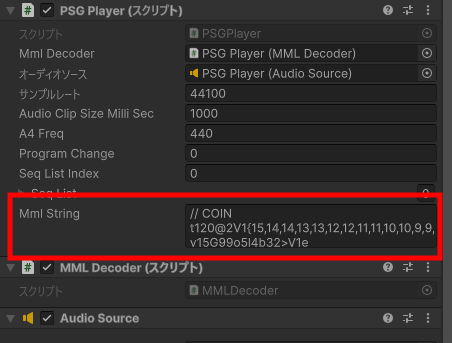

# Unity PSG Player

Unity上でレトロゲーム機などのPSG（Programmable Sound Generator）音源を鳴らすライブラリです。  
演奏データはMML（Music Macro Language）のテキストで、楽譜を文字で記述するため、手軽に音楽データを作成できます。  
ファミコンの音源に似た（DPCMを除く）表現ができるように設計しています。  

* 音色は、矩形波4種類、三角波、ノイズ2種類が鳴らせます。三角波は4bit波形です。
* 演奏表現として、スイープ、LFO（ビブラート）、音量エンベロープが使えます。

> ファミコン音源の完全再現は目標にしていません。（めんどくさいので。）  
> あくまでも、別途サウンドクリップなどを用意しないで、Unityだけで音を鳴らす目的で制作しています。  

PSG Playerはモノフォニック（単音）で発音します。  
ファミコンの4音（DPCMを除く）などを再現するには、PSG Playerを複数設置して同時に再生することで対応します。  

## クイックガイド

### 基本的な使い方

1. PSG Playerプレハブをヒエラルキーに置きます。  


2. 操作するスクリプトでPSGPlayerクラス変数を用意し、設置したPSG Playerオブジェクトをアタッチします。  


3. PSGPlayerの[mmlString](#mmlstring)変数に記述したMMLが、[Play()](#play)で再生されます。  
MMLについては「[MMLリファレンス](Unity%20PSG%20Player%20-%20MML%20reference.md)」を参照してください。  


### マルチチャンネルの使い方

1. 必要なチャンネル数に合わせてPSG Playerプレハブを置きます。  


2. 適当なゲームオブジェクトにMMLSplitterスクリプトをアタッチします。  
3. インスペクターからMMLSplitterの[psgPlayers](#psgplayers)に、設置したPSG Playerを割り当てます。  


4. MMLSplitterの[multiChMMLString](#multichmmlstring)変数にMMLを入れて、[SplitMML()](#splitmml)で各チャンネルにMMLを分配し、[PlayAllChannels()](#playallchannels)で再生されます。  


## 構成

Unity PSG Playerは、

* シーケンスデータに沿って音を生成する「**PSG Player**」
* MMLをシーケンスデータに変換する「**MML Decoder**」
* MMLを分割する「**MML Splitter**」

で構成されています。  


単音で使用する場合はMML Splitterは必要ありません。  
また、PSG Playerで生成した音を鳴らすためにAudioSourceコンポーネントが必要になります。  

## 概要

PSG Playerは矩形波（パルス波）、三角波、ノイズを単音（モノフォニック）で生成します。  
生成した音はAudioClipとしてAudioSourceのリソースにアタッチされ、ストリーム再生します。  
ストリーム再生中のAudioClipは、必要なバッファ分のデータを順次要求し、その都度PSG Playerが波形データを計算します。  

PSG Playerは、List配列のシーケンスデータを順次処理して、音程や音量を計算します。  
MMLからシーケンスデータへの変換はMML Decoderで行います。  

また、マルチチャンネルMMLを振り分けるのにMML Splitterを使います。  
MMLの行ごとに処理し、行頭の文字で振り分けるチャンネルを決定します。  
詳しくは「[MMLリファレンス](Unity%20PSG%20Player%20-%20MML%20reference.md#トラックのヘッダー)」を参照してください。  
MML SplitterはMMLの分配の他に、各PSG Playerのコントロールをまとめて行うことができます。  

効果音をPSGで鳴らす場合、レトロゲーム機などではBGMの1チャンネルの演奏を中断してリアルタイムで効果音を再生していましたが、
PSG Playerでは先読みして演奏した音がバッファリングされる仕様なので、効果音をタイミングよく再生することができません。  
PSG Playerで効果音を再現するには、効果音専用のPSG Playerを別で用意し、BGMの1チャンネルをミュートすることで対応してください。  

なお、マルチチャンネルでPSG Playerを使う場合、AudioMixerを利用すると音量の調整などがしやすくなります。  

## サンプルレートについて

PSG Playerでは生成するAudioClipのサンプルレートを設定できます。  
サンプルレートは1秒間に入るサンプル数です。  
1サンプル毎に処理を行うので、サンプルレートを高くするとCPU負荷も高くなります。  

また、サンプルレートは生成する音の周波数の上限にも影響します。  
音色によって1波長に必要なサンプル数は以下の通りです。  

| 音色 | サンプル数 |
|:----|:----|
| 矩形波 | 2サンプル |
| 25%(75%)パルス波 | 4サンプル |
| 12.5%パルス波 | 8サンプル |
| 三角波 | 32サンプル |

問題なく出せる音の周波数は、サンプルレートを上記のサンプル数で割った値となるので、~~特に三角波は最高音程が低くなります。~~  

`v0.9.2beta`三角波の生成ロジックを少し変更したので、矩形波と同程度の高音まで出せるようになりました。

※あくまでも期待通りの音程が出せる上限であり、高音になると音色は崩れていきます。  
 デフォルトのサンプリングレートでは、ちゃんとした音が出るのはおおよそ7オクターブ目(o7)ぐらいまでです。  
※ノイズは独特な処理をしているので、サンプルレートが低いと高音で音量が下がります。  

## 演奏表現について

PSG Playerでは、演奏表現としてボリュームエンベロープ・スイープ・LFOが使えます。  
ただし、ノイズ音色および周波数指定で出した音は、ピッチ変化の効果があるスイープとLFOは無効になります。  

## レンダリングについて

`v0.9.6beta`

PSG PlayerはAudioClip.Create()のStreamを使うことを前提に開発してきました。  
ストリーム再生は負荷を分散するのでBGMのような長時間のシーケンスでもそこそこレスポンスよく演奏することができます。  
ただ、Create()を呼んだ時点でバッファリングが発生するため、タイミングにシビアな効果音を鳴らすには少し懸念がありました。  
  
レンダリングはシーケンス全体をAudioClipの波形データとして出力します。  
この波形データを事前に作っておくことで、通常の音源ファイルを鳴らすのと同等のパフォーマンスができるようになります。  
しかし、レンダリングは負荷が高いので、長時間の演奏を変換するとフリーズが発生します。  
  
非同期レンダリングを使うと、一定間隔ごとにメインスレッドに戻るので負荷を分散できます。  
その代わり、レンダリングを完了するまでの時間は伸びます。  
用途に合わせてストリーム、レンダリング、非同期レンダリングを使い分けるのをお勧めします。  
  
なお、レンダリングの際はシーケンスのループコマンド（MMLのループ「L」）は無効になります。  
（Unityの謎仕様で、音源ファイルに埋め込んだループポイントはAudioClipに反映されるのに、Createで作ると入れる手段がないという…）

ちなみにWebGLではAudioClip.Create()のStreamが非対応（鳴るけどバッファが更新されない）ですが、レンダリングしたAudioClipは再生することができます。

## PSG Playerスクリプトリファレンス

### 変数・Public関数一覧

* [変数](#変数)
  * [mmlDecoder](#mmldecoder)
  * [audioSource](#audiosource)
  * [sampleRate](#samplerate)
  * [audioClipSizeMilliSec](#audioclipsizemillisec)
  * [a4Freq](#a4freq)
  * [tickPerNote](#tickpernote)
  * [programChange](#programchange)
  * [seqListIndex](#seqlistindex)
  * [seqList](#seqlist)
  * [mmlString](#mmlstring)
  * [asyncRenderIsDone](#asyncrenderisdone)
  * [asyncRenderProgress](#asyncrenderprogress)
  * [renderedDatas](#rendereddatas)
* [Public関数](#public関数)
  * [Play()](#play)
  * [Play(string \_mmlString)](#playstring-_mmlstring)
  * [DecodeMML()](#decodemml)
  * [PlayDecoded()](#playdecoded)
  * [PlaySequence()](#playsequence)
  * [Stop()](#stop)
  * [IsPlaying()](#isplaying)
  * [Mute(bool isOn)](#mutebool-ison)
  * [ExportSeqJson(bool _prettyPrint)](#exportseqjsonbool-_prettyprint)
  * [DecodeAndExportSeqJson(bool _prettyPrint)](#decodeandexportseqjsonbool-_prettyprint)
  * [GetSeqJson()](#getseqjson)
  * [ImportSeqJson(string _jsonString)](#importseqjsonstring-_jsonstring)
  * [SetSeqJson(SeqJson _seqJson)](#setseqjsonseqjson-_seqjson)
  * [RenderSequenceTodClipData()](#rendersequencetodclipdata)
  * [ExportRenderedAudioClip(bool isAsyncRendered)](#exportrenderedaudioclipbool-isasyncrendered)
  * [RenderSeqToClipDataAsync(int interruptSample)](#renderseqtoclipdataasyncint-interruptsample)
  * [CalcSeqSample()](#calcseqsample)
  * [PlayRenderedClipData(bool isLoop)](#playrenderedclipdatabool-isloop)

----

### 変数

----

#### mmlDecoder

``` c# PSGPlayer.cs
[SerializeField] private MMLDecoder mmlDecoder;
```

MMLをシーケンスデータに変換するMML Decoderコンポーネントを登録します。  

----

#### audioSource

``` c# PSGPlayer.cs
[SerializeField] private AudioSource audioSource;
```

生成したAudioClipを渡すAudioSourceを登録します。  

----

#### sampleRate

``` c# PSGPlayer.cs
public int sampleRate = 32000;
```

AudioClipのサンプルレートを設定します。  
デフォルトは32000Hz（32kHz）です。  

----

#### audioClipSizeMilliSec

``` c# PSGPlayer.cs
public int audioClipSizeMilliSec = 1000;
```

AudioClipの長さを設定します。  
デフォルトは1000msec（1秒）です。  

----

#### a4Freq

``` c# PSGPlayer.cs
public float a4Freq = 440f;
```

音階の基準となるオクターブ4のラ（o4a）の音の周波数を設定します。  
デフォルトは440Hzです。  
この変数はMMLのコマンドで変更することができます。  

----

#### tickPerNote

``` C# PSGPlayer.cs
public int tickPerNote = 960;
```

1拍（4分音符）の分解能を設定します。  
音長はこの分解能に基づいたティック数に変換され、実際の音の長さ（秒）はテンポとこの分解能から計算されます。  

(例：8分音符は480ティックとなり、テンポ120の場合音の長さは  
60[sec] / 120[notePerMin] * 480[tick] / 960[tickPerNote] = 0.25[sec]  
で0.25秒となります。)  

----

#### programChange

``` c# PSGPlayer.cs
public int programChange;
```

生成する音色の番号です。  

| 番号 | 波形 |
|:--:|:-- |
| 0 | パルス波（12.5%） |
| 1 | パルス波（25%） |
| 2 | 矩形波（50%） |
| 3 | パルス波（75%） |
| 4 | 三角波 |
| 5 | ノイズ |
| 6 | 短周期ノイズ |

この変数はMMLのコマンドで変更することができます。

----

#### seqListIndex

``` c# PSGPlayer.cs
[SerializeField] private int seqListIndex = 0;
```

シーケンスデータの処理中の位置です。  
主にデバッグ用途で表示します。  

----

#### seqList

``` c# PSGPlayer.cs
[SerializeField] private List<SeqEvent> seqList = new();
```

シーケンスデータのList配列です。  
主にデバッグ用途で表示します。  

----

#### mmlString

``` c# PSGPlayer.cs
[Multiline] public string mmlString = "";
```

演奏するMML文字列です。  
この変数をMML Decoderに渡してシーケンスデータに変換します。  

----

#### asyncRenderIsDone

``` C# PSGPlayer.cs
public bool asyncRenderIsDone { get; private set; } = false;
```

`v0.9.6beta`

非同期レンダリングが完了すると`True`になります。  
[RenderSeqToClipDataAsync()](#renderseqtoclipdataasyncint-interruptsample)を呼び出した後に使用します。

----

#### asyncRenderProgress

``` C# PSGPlayer.cs
public float asyncRenderProgress { get; private set; } = 0f;
```

`v0.9.6beta`

非同期レンダリングの進捗率で0から1の範囲で増加します。  
[RenderSeqToClipDataAsync()](#renderseqtoclipdataasyncint-interruptsample)を呼び出した後に使用します。

----

#### renderedDatas

``` C# PSGPlayer.cs
public float[] renderedDatas { get; private set; }
```

`v0.9.6beta`

[RenderSequenceTodClipData()](#rendersequencetodclipdata)または[RenderSeqToClipDataAsync()](#renderseqtoclipdataasyncint-interruptsample)で生成されたクリップデータが入ります。  

----

### Public関数

----

#### Play()

``` c# PSGPlayer.cs
public void Play();
```

* パラメーター：なし  

[mmlString](#mmlstring)のMML文字列をシーケンスデータに変換して、再生を開始します。  

----

#### Play(string _mmlString)

``` c# PSGPlayer.cs
public void Play(string _mmlString);
```

* パラメーター：**_mmlString**　MML文字列  

パラメーターの引数を[mmlString変数](#mmlstring)に渡して、シーケンスデータに変換して再生を開始します。  

----

#### DecodeMML()

``` c# PSGPlayer.cs
public bool DecodeMML();
```

* パラメーター：なし  
* 戻り値：デコード成功で`True`

[mmlString](#mmlstring)のMML文字列をMML Decoderに渡してシーケンスデータに変換します。  

----

#### PlayDecoded()

``` c# PSGPlayer.cs
public void PlayDecoded();
```

* パラメーター：なし  

デコード済みのシーケンスデータを再生します。  
変換処理を行わないので、CPU負荷の軽減が期待できます。  

----

#### PlaySequence()

``` c# PSGPlayer.cs
public void PlaySequence();
```

* パラメーター：なし  

デコード済みのシーケンスデータを再生します。  
[PlayDecoded()](#playdecoded)と同じです。

----

#### Stop()

``` c# PSGPlayer.cs
public void Stop();
```

* パラメーター：なし

再生中の音を停止します。  

----

#### IsPlaying()

``` c# PSGPlayer.cs
public bool IsPlaying();
```

* パラメーター：なし
* 戻り値：再生中なら`True`

[AudioSource](#audiosource)の再生状況を返します。  

----

#### Mute(bool isOn)

``` c# PSGPlayer.cs
public void Mute(bool isOn);
```

* パラメーター：**isOn**　`True`ならミュートオン

ミュートをオンにすると、[AudioSource](#audiosource)をミュートにした上で、生成されるサンプルを0（無音）にします。  
`False`で解除すると、[AudioSource](#audiosource)は即時にミュート解除されますが、サンプルは次のノートイベントが発生するまで無音を継続します。  
ただし、バッファ済みのサンプルより早くミュート解除した場合は、すでに生成されたサンプルが発音されます。  

----

#### ExportSeqJson(bool _prettyPrint)

``` c# PSGPlayer.cs
public string ExportSeqJson(bool _prettyPrint)
```

`v0.9.3beta`

* パラメーター：**_prettyPrint**　`True`で改行やインデントが有効（省略時`False`）
* 戻り値：**JSON形式の文字列**

デコードされたMMLのシーケンスデータをJSON化して文字列として出力します。  
シーケンスデータが無い（[DecodeMML()](#decodemml)や[Play()](#play)を行ってない）場合はNullが戻ります。  
JSONの中身は、[tickPerNote](#tickpernote)の値と[seqList](#seqlist)を組み合わせたものになります。

----

#### DecodeAndExportSeqJson(bool _prettyPrint)

``` c# PSGPlayer.cs
public string DecodeAndExportSeqJson(bool _prettyPrint)
```

`v0.9.3beta`

* パラメーター：**_prettyPrint**　`True`で改行やインデントが有効（省略時`False`）
* 戻り値：**JSON形式の文字列**

MMLをデコードしてからシーケンスデータをJSON化して出力します。  

----

#### GetSeqJson()

``` c# PSGPlayer.cs
public SeqJson GetSeqJson()
```

`v0.9.3beta`

* パラメーター：なし
* 戻り値：**SeqJsonクラスオブジェクト**

デコードされたMMLのシーケンスデータをSeqJsonクラスオブジェクトとして出力します。  
[ExportSeqJson()](#exportseqjsonbool-_prettyprint)でJSON化する前のデータです。  
主にMML SplitterでマルチチャンネルJSONをエクスポートする際に利用します。

----

#### ImportSeqJson(string _jsonString)

``` c# PSGPlayer.cs
public bool ImportSeqJson(string _jsonString)
```

`v0.9.3beta`

* パラメーター：**_jsonString**　JSON形式の文字列
* 戻り値：インポート成功で`True`

JSON形式の文字列をシーケンスデータとしてインポートします。  
この際、[tickPerNote](#tickpernote)の値も読み込まれます。

----

#### SetSeqJson(SeqJson _seqJson)

``` c# PSGPlayer.cs
public bool SetSeqJson(SeqJson _seqJson)
```

`v0.9.3beta`

* パラメーター：**_seqJson**　SeqJsonクラスオブジェクト
* 戻り値：インポート成功で`True`

SeqJsonクラスオブジェクトから直接[tickPerNote](#tickpernote)の値とシーケンスデータを読み込みます。  
主にMML SplitterでマルチチャンネルJSONをインポートする際に利用します。

----

#### RenderSequenceTodClipData()

``` c# PSGPlayer.cs
public float[] RenderSequenceTodClipData()
```

`v0.9.4beta`

* パラメーター：なし
* 戻り値：**float配列で構成されるサンプルデータ**

シーケンス全体の波形データを生成します。  
[sampleRate](#samplerate)で指定されたサンプルレートで1サンプル毎に計算し、各サンプルをfloat配列にして返します。  
サンプルレートが高いほど、そしてシーケンスが長いほど、レンダリングに時間がかかります。  
また、シーケンスのループコマンド（[MMLのループ"L"](Unity%20PSG%20Player%20-%20manual_JP.md)）は、レンダリング時は無効になります。

`v0.9.6beta`

生成されたクリップデータは[renderedDatas](#rendereddatas)にも入ります。  

----

#### ExportRenderedAudioClip(bool isAsyncRendered)

``` c# PSGPlayer.cs
public AudioClip ExportRenderedAudioClip(bool isAsyncRendered)
```

`v0.9.4beta`

* パラメーター：なし
* 戻り値：**AudioClip**

シーケンス全体の波形データを生成し、AudioClipにしてエクスポートします。  
AudioClipのサンプルレートは[samplRate](#samplerate)で指定した値になります。  
効果音などレスポンスを重視したい場合に、この関数でAudioClipを先に用意しておくことができます。  
逆にBGMなど長いシーケンスの場合は、レンダリングに時間がかかるので注意が必要です。

`v0.9.6beta`

* パラメーター：**isAsyncRendered**　`True`でrenderdDatasを使用（省略時`False`）
* 戻り値：**AudioClip**

レンダリングを行わずに[renderedDatas](#rendereddatas)を使ってAudioClipをエクスポートします。  

----

#### RenderSeqToClipDataAsync(int interruptSample)

``` c# PSGPlayer.cs
public bool RenderSeqToClipDataAsync(int interruptSample)
```

`v0.9.6beta`

* パラメーター：**interruptSample**　処理が中断されるサンプル数
* 戻り値：レンダリングの開始に成功した場合に`True`

シーケンス全体の波形データの非同期レンダリングを開始します。  
メインスレッドのUpdate()内などでレンダリングを監視してください。
レンダリングの進捗率は[asyncRenderProgress](#asyncrenderprogress)で0から1の範囲で増加します。  
レンダリングが完了すると[asyncRenderIsDone](#asyncrenderisdone)が`True`になります。  
生成されたクリップデータは[renderedDatas](#rendereddatas)に入ります。  
[ExportRenderedAudioClip(true)](#exportrenderedaudioclipbool-isasyncrendered)で[renderedDatas](#rendereddatas)をAudioClipに変換できます。  
なお、シーケンスのループコマンド（[MMLのループ"L"](Unity%20PSG%20Player%20-%20manual_JP.md)）は、レンダリング時は無効になります。

----

#### CalcSeqSample()

``` c# PSGPlayer.cs
public int CalcSeqSample()
```

`v0.9.6beta`

* パラメーター：なし
* 戻り値：レンダリング後のサンプル数

レンダリングした場合に生成されるクリップデータのサイズを計算します。

----

#### PlayRenderedClipData(bool isLoop)

``` c# PSGPlayer.cs
public bool PlayRenderedClipData(bool isLoop)
```

`v0.9.6beta`

* パラメーター：**isLoop**　`True`ならループ再生
* 戻り値：再生に成功した場合に`True`

[renderedDatas](#rendereddatas)を使ってAudioClipを生成し、PSG Playerに指定されているAudioSourceで再生します。

----

## MML Splitterスクリプトリファレンス

### [MML Splitter] 変数・Public関数一覧

* [変数](#mml-splitter-変数)
  * [psgPlayers](#psgplayers)
  * [multiChMMLString](#multichmmlstring)
  * [asyncMultiRenderIsDone](#asyncmultirenderisdone)
  * [asyncMultiRenderProgress](#asyncmultirenderprogress)
* [Public関数](#mml-splitter-public関数)
  * [SplitMML()](#splitmml)
  * [SplitMML(string \_multiChMMLString)](#splitmmlstring-_multichmmlstring)
  * [SetAllChannelsSampleRate(int \_rate)](#setallchannelssamplerateint-_rate)
  * [SetAllChannelClipSize(int \_msec)](#setallchannelclipsizeint-_msec)
  * [PlayAllChannels()](#playallchannels)
  * [PlayAllChannelsDecoded()](#playallchannelsdecoded)
  * [PlayAllChannelsSequence()](#playallchannelssequence)
  * [DecodeAllChannels()](#decodeallchannels)
  * [StopAllChannels()](#stopallchannels)
  * [IsAnyChannelPlaying()](#isanychannelplaying)
  * [MuteChannel(int channel, bool isMute)](#mutechannelint-channel-bool-ismute)
  * [ExportMultiSeqJson(bool _prettyPrint)](#exportmultiseqjsonbool-_prettyprint)
  * [DecodeAndExportMultiSeqJson(bool _prettyPrint)](#decodeandexportmultiseqjsonbool-_prettyprint)
  * [ImportMultiSeqJson(string _jsonString)](#importmultiseqjsonstring-_jsonstring)
  * [ExportMixedAudioClip(int _sampleRate, bool isAsyncRendered)](#exportmixedaudioclipint-_samplerate-bool-isasyncrendered)
  * [RenderMultiSeqToClipDataAsync(int _sampleRate, int interruptSample)](#rendermultiseqtoclipdataasyncint-_samplerate-int-interruptsample)
  * [PlayAllChannelsRenderedClipData(bool isLoop)](#playallchannelsrenderedclipdatabool-isloop)

----

### [MML Splitter] 変数

----

#### psgPlayers

``` c# MMLSplitter.cs
[SerializeField] private PSGPlayer[] psgPlayers;
```

MMLを分割送信するPSG Playerコンポーネントをチャンネルの数だけ登録します。  

----

#### multiChMMLString

``` c# MMLSplitter.cs
public string multiChMMLString;
```

分割送信する元のMML文字列を登録します。  

----

#### asyncMultiRenderIsDone

``` c# MMLSplitter.cs
public bool asyncMultiRenderIsDone { get; private set; } = false;
```

`v0.9.6beta`

全てのチャンネルで非同期レンダリングが完了すると`True`になります。  
[RenderMultiSeqToClipDataAsync()](#rendermultiseqtoclipdataasyncint-_samplerate-int-interruptsample)を呼び出した後に使用します。

----

#### asyncMultiRenderProgress

``` c# MMLSplitter.cs
public float asyncMultiRenderProgress { get; private set; } = 0f;
```

`v0.9.6beta`

全てのチャンネルの非同期レンダリングの進捗率で0から1の範囲で増加します。  
[RenderMultiSeqToClipDataAsync()](#rendermultiseqtoclipdataasyncint-_samplerate-int-interruptsample)を呼び出した後に使用します。

----

### [MML Splitter] Public関数

----

#### SplitMML()

``` c# MMLSplitter.cs
public void SplitMML();
```

* パラメーター：なし

multiChMMLStringのMML文字列を分割して、psgPlayersに登録されてるPSG Playerに送信します。  
送信チャンネルの振り分けについては「[MMLリファレンス](Unity%20PSG%20Player%20-%20MML%20reference.md#トラックのヘッダー)」を参照してください。  

----

#### SplitMML(string _multiChMMLString)

``` c# MMLSplitter.cs
public void SplitMML(string _multiChMMLString);
```

* パラメーター：**_multiChMMLString**　マルチチャンネルのMML文字列

パラメーターの引数を[multiChMMLString変数](#multichmmlstring)に渡して、MMLをPSG Playerに分割送信します。  

----

#### SetAllChannelsSampleRate(int _rate)

``` c# MMLSplitter.cs
public void SetAllChannelsSampleRate(int _rate);
```

* パラメーター：**_rate**　サンプルレート

全てのPSG Playerのサンプルレートを設定します（単位Hz）。  

----

#### SetAllChannelClipSize(int _msec)

``` c# MMLSplitter.cs
public void SetAllChannelClipSize(int _msec);
```

* パラメーター：**_msec**　AudioClipの長さ

全てのPSG PlayerのAudioClip長さを設定します（単位ミリ秒）。  

----

#### PlayAllChannels()

``` c# MMLSplitter.cs
public void PlayAllChannels();
```

* パラメーター：なし

全てのPSG Playerで同時にMMLをデコードして再生します。  
マルチチャンネルMMLの分割送信は行わないので、事前に[SplitMML()](#splitmml)を実行してください。

----

#### PlayAllChannelsDecoded()

``` c# MMLSplitter.cs
public void PlayAllChannelsDecoded();
```

* パラメーター：なし

全てのPSG Playerで同時にデコード済みのシーケンスデータを再生します。  

----

#### PlayAllChannelsSequence()

``` c# MMLSplitter.cs
public void PlayAllChannelsSequence()
```

* パラメーター：なし

全てのPSG Playerで同時にシーケンスデータを再生します。  
[PlayAllChannelsDecoded()](#playallchannelsdecoded)と同じです。

----

#### DecodeAllChannels()

``` c# MMLSplitter.cs
public void DecodeAllChannels()
```

* パラメーター：なし

全てのPSG PlayerでMMLをシーケンスデータにデコードします。  
マルチチャンネルMMLの分割送信は行わないので、事前に[SplitMML()](#splitmml)を実行してください。

----

#### StopAllChannels()

``` c# MMLSplitter.cs
public void StopAllChannels();
```

* パラメーター：なし

全てのPSG Playerの再生を停止します。  

----

#### IsAnyChannelPlaying()

``` c# MMLSplitter.cs
public bool IsAnyChannelPlaying();
```

* パラメーター：なし
* 戻り値：いずれかのPSG Playerが再生中なら`True`

各PSG Playerの[AudioSource](#audiosource)のうち、どれか一つでも再生中なら`True`を返します。  

----

#### MuteChannel(int channel, bool isMute)

``` c# MMLSplitter.cs
public void MuteChannel(int channel, bool isMute);
```

* パラメーター：**channel**　対象チャンネル  
　　　　　　　**isMute**　`True`ならミュートオン

指定したチャンネルをミュートします。

----

#### ExportMultiSeqJson(bool _prettyPrint)

``` c# MMLSplitter.cs
public string ExportMultiSeqJson(bool _prettyPrint)
```

`v0.9.3beta`

* パラメーター：**_prettyPrint**　`True`で改行やインデントが有効（省略時`False`）
* 戻り値：**JSON形式の文字列**

各PSG PlayerのデコードされたMMLのシーケンスデータをまとめてJSON化して文字列として出力します。  
JSONの中身は、各PSG Playerで出力した[SeqJsonクラスオブジェクト](#getseqjson)をリスト化したものになります。

----

#### DecodeAndExportMultiSeqJson(bool _prettyPrint)

``` c# MMLSplitter.cs
public string DecodeAndExportMultiSeqJson(bool _prettyPrint)
```

`v0.9.3beta`

* パラメーター：**_prettyPrint**　`True`で改行やインデントが有効（省略時`False`）
* 戻り値：**JSON形式の文字列**

各PSG PlayerのMMLをデコードしてからシーケンスデータをJSON化して出力します。  
マルチチャンネルMMLの分割送信は行わないので、事前に[SplitMML()](#splitmml)を実行してください。

----

#### ImportMultiSeqJson(string _jsonString)

``` c# MMLSplitter.cs
public void ImportMultiSeqJson(string _jsonString)
```

`v0.9.3beta`

* パラメーター：**_jsonString**　JSON形式の文字列

JSON形式の文字列をマルチチャンネルのシーケンスデータとしてインポートします。  

----

#### ExportMixedAudioClip(int _sampleRate, bool isAsyncRendered)

``` c# MMLSplitter.cs
public AudioClip ExportMixedAudioClip(int _sampleRate, bool isAsyncRendered)
```

`v0.9.4beta`

* パラメーター：**_sampleRate**　AudioClipのサンプルレート
* 戻り値：**AudioClip**

各PSG Playerでレンダリングした波形データをミックスしてAudioClipをエクスポートします。  
混合した波形データがサンプル値の範囲を超えないように、チャンネル数で割った値で合成します。  
そのため、単音の最大音量はチャンネル数によって減少します。  
また、全チャンネルでサンプルレートを揃える必要があるので、この関数を使用後は各PSG Playerの[sampleRate](#samplerate)が引数で指定した値になります。  
全部のPSG Playerでレンダリングした後にミックスするので、特に長いシーケンスの場合は処理に時間がかかるので注意してください。

`v0.9.6beta`

* パラメーター：**_sampleRate**　AudioClipのサンプルレート
* パラメーター：**isAsyncRendered**　`True`でレンダリング済みの波形データを使用（省略時`False`）
* 戻り値：**AudioClip**

isAsyncRenderedを`True`にすると、各チャンネルでレンダリングした[renderedDatas](#rendereddatas)をミックスしてAudioClipをエクスポートします。  
この場合レンダリングはしないので、[RenderMultiSeqToClipDataAsync()](#rendermultiseqtoclipdataasyncint-_samplerate-int-interruptsample)を呼び出した後、[asyncMultiRenderIsDone](#asyncmultirenderisdone)が`True`になってから使用してください。

----

#### RenderMultiSeqToClipDataAsync(int _sampleRate, int interruptSample)

``` c# MMLSplitter.cs
public bool RenderMultiSeqToClipDataAsync(int _sampleRate, int interruptSample)
```

`v0.9.6beta`

* パラメーター：**_sampleRate**　AudioClipのサンプルレート
* パラメーター：**interruptSample**　処理が中断されるサンプル数
* 戻り値：いずれかのチャンネルでレンダリングが開始したら`True`

全チャンネルで非同期レンダリングを開始します。  
メインスレッドのUpdate()内などでレンダリングを監視してください。  
レンダリングの進捗率は[asyncMultiRenderProgress](#asyncmultirenderprogress)で0から1の範囲で増加します。  
レンダリングが完了すると[asyncMultiRenderIsDone](#asyncmultirenderisdone)が`True`になります。  
生成されたクリップデータは各PSG Playerの[renderedDatas](#rendereddatas)に入ります。  
[ExportMixedAudioClip()](#exportmixedaudioclipint-_samplerate-bool-isasyncrendered)で[renderedDatas](#rendereddatas)をミックスしてAudioClipに変換できます。  
なお、シーケンスのループコマンド（[MMLのループ"L"](Unity%20PSG%20Player%20-%20manual_JP.md)）は、レンダリング時は無効になります。

----

#### PlayAllChannelsRenderedClipData(bool isLoop)

``` c# MMLSplitter.cs
public void PlayAllChannelsRenderedClipData(bool isLoop)
```

`v0.9.6beta`

* パラメーター：**isLoop**　`True`ならループ再生
* 戻り値：なし

各チャンネルで[renderedDatas](#rendereddatas)を使ってAudioClipを生成し、それぞれのPSG Playerに指定されているAudioSourceで再生します。  
ミックスされずに鳴らすので、各チャネルの音量変更やミュートをすることができます。

----
